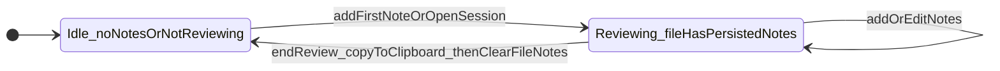

# Markdown review extension — requirements

## Summary

A VS Code extension (compatible with **VS Code**, **Cursor**, and **Kiro**) that helps humans **review Markdown** produced by AI agents (specs, plans, requirement docs). Reviewers can attach **flat notes** to a **line** or **selected range**, see them while working in the **editor** and **Markdown preview**, and **export** all notes for a file in one step. **v1** focuses on **clipboard export** only—no automated “send to chat.”

**Basic implementation:** Both **editor** and **preview** are **in scope for v1**—reviewing in the rendered view and in source are both first-class; neither is deferred as a later phase.

---

## Problem and audience

- **Problem:** Reviewing agent-generated `.md` files requires leaving many small remarks tied to specific places in the document; ad-hoc copy/paste is error-prone and does not preserve structure.
- **Audience:** Developers and tech leads who review plans/specs inside the IDE before approving or iterating with an agent.

---

## User stories

1. As a reviewer, I can **add a note** anchored to a **line** or **selection** in a Markdown file while I read it.
2. As a reviewer, I can **see my notes** in context in both the **editor** and **Markdown preview** without losing them when I **restart the IDE**.
3. As a reviewer, I can **finish review** for the **current file**: **copy all notes** in one human-readable blob, after which **notes for that file are cleared**.
4. As a reviewer, I expect **editing the file** not to **delete** my notes; notes may **no longer align** with content until a future iteration improves anchoring.
5. As a reviewer, I can **review using the Markdown preview** as well as the editor—**preview is not optional** for the first shippable version.

---

## Functional requirements

### Comment model

- **Flat notes only** for v1: no threads, replies, resolve states, or @mentions.

### Anchoring (v1)

- Notes are tied to **line numbers** (and a **from–to line range** when the note was created from a selection).
- If the file changes, notes **must not be removed**. Misalignment (note appears to refer to the wrong lines) is **acceptable** in v1.
- Stronger anchoring (e.g. by content hash or structural IDs) is **out of scope** for v1; track as backlog.

### Surfaces

- **Editor:** Required for v1 (add/view notes tied to lines or selections).
- **Markdown preview:** Required for v1 as well—users often review rendered Markdown; preview and editor are **both** part of the basic implementation, not an optional follow-up.

### Persistence

- Notes persist **while review is active** for a file, including **after IDE restart**.
- **No Git:** review state is not part of the repository workflow; do not require commits or PR metadata.
- Storage is **local / workspace-scoped** (exact mechanism is an implementation detail: e.g. `ExtensionContext.workspaceState`, or a file under `.vscode` or a dedicated workspace path—**not** committed by default).

### Session model

- **One session per file:** Clearing happens **only for the file** whose review is ended.

### End review flow

1. User runs **end review** (or equivalent) for the **current file**.
2. Extension builds a **single aggregated export** and copies it to the **clipboard**.
3. **After** a successful copy, **all notes for that file** are **removed** from storage.

If “copy without clearing” is needed later, treat it as a separate feature; v1 ties **clear** to **end review + copy**.

---

## Export / clipboard (v1)

- **Only** bundled **copy to clipboard**. No dependency on **send to chat** (Cursor/Kiro do not expose stable public APIs for injecting into chat).
- Export must be **human-readable** and include, for each note:
  - **File identity** (e.g. workspace-relative path or `file` URI—exact choice in implementation).
  - **Line or line range** (and optionally a short **quoted snippet** of the line(s) at export time—optional spike).
  - **Comment body** (plain text; support for **Markdown** in the body, including **fenced code blocks**, is **desirable** so pasted output stays readable in chats and docs).

**Acceptance (v1):** After paste into another tool, a reader can tell **which file** and **roughly where** each note applies.

**Follow-up spike:** Define a **concrete export template** (plain text vs Markdown sections, delimiter style, whether to embed snippets). Deferred until implementation.

---

## Non-goals (v1)

- GitHub / PR integration, inline “review” UI matching host PRs.
- Threaded or nested comments.
- Programmatic **send to AI chat** (Cursor, Kiro, or generic).
- Requiring review state to be **committed** or shared via Git.
- Perfect positional accuracy after heavy edits (explicitly deferred).

---

## Open questions / backlog

- **Export template:** Final structure for multi-note bundles; Markdown vs plain text; code fences in bodies.
- **Anchoring v2:** Content-based or hybrid anchoring when line numbers drift.
- **Preview UX details:** How notes map to preview DOM (e.g. click-to-comment vs editor-only add); read-only vs add from preview—decide during implementation.
- **Same file, multiple windows:** Single shared session vs edge-case behavior—decide during implementation.

---

## Review lifecycle (state)

---

## Verification (this document)

- [x] Matches agreed scope: flat notes, per-file session, clipboard export, no Git, line-based anchoring with survive-on-edit, **editor and preview both in v1 basic implementation**.
