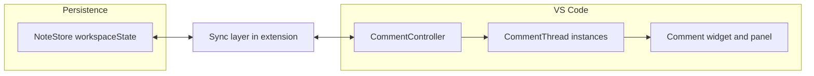

# Markdown review via `vscode.comments`

## Baseline

- `[src/extension.ts](src/extension.ts)` only registers `markdownReview.hello`; `[package.json](package.json)` activates on that command.
- Goal: greenfield implementation using the same mechanics as [microsoft/vscode-extension-samples `comment-sample](https://github.com/microsoft/vscode-extension-samples/tree/main/comment-sample)`: `commentingRangeProvider`, `createCommentThread`, `CommentReply`-backed commands, and `comments/*` menu contributions keyed on `commentController == <id>`.

## Architecture

- **Controller**: `vscode.comments.createCommentController('markdownReview', 'Markdown Review')` (id must match `when` clauses in `package.json`).
- **Where comments are allowed**: `commentingRangeProvider` returning commenting ranges for **Markdown only** (mirror sample: whole document as `[new Range(0, 0, lineCount - 1, document.lineAt(lineCount - 1).text.length)]` or end-of-last-line variant used in sample—pick one consistent with VS Code behavior).
- **Creating / replying**: Register commands that take `[CommentReply](https://code.visualstudio.com/api/references/vscode-api#CommentReply)` (see sample `mywiki.createNote` / `mywiki.replyNote`). Contribute them under `comments/commentThread/context` with `when: commentController == markdownReview && commentThreadIsEmpty` vs `!commentThreadIsEmpty`, and `enablement: "!commentIsEmpty"` where appropriate (same as sample).
- **Edit / delete / save / cancel**: Same pattern as sample: `comments/comment/title` and `comments/comment/context` for edit/delete/save/cancel; handlers mutate `thread.comments` and `comment.mode` (`Preview` vs `Editing`).
- **Optional discoverability**: Add an editor command (e.g. `markdownReview.addComment`) **not** hidden from palette: if there is a non-empty selection in a Markdown editor, call `createCommentThread(uri, range, [])`, set `collapsibleState` to `Expanded`, so the native input appears. Contribute context menu `editorLangId == markdown` + selection. This complements gutter-based flow.

## Persistence (new module)

Reintroduce a small store (e.g. `[src/noteStore.ts](src/noteStore.ts)`) separate from UI:

- **Shape**: `Record<uriString, StoredThread[]>` where each `StoredThread` has `{ threadId, range, comments: { id, body, createdAt }[] }` (align field names with what you need for display; `threadId` and per-comment `id` must be stable strings, e.g. `crypto.randomUUID()`).
- **Operations**: load all threads for a URI; upsert thread after any mutation; delete thread; update comment body after save.
- **Runtime mapping**: maintain `WeakMap<vscode.CommentThread, string>` (thread → `threadId`) when you create or rehydrate threads so every command can find the right stored row.

**Session restore**: On activation, after creating the controller, iterate stored threads for currently open docs is optional; minimally, on `workspace.onDidOpenTextDocument` / initial scan, call `createCommentThread` for each stored thread on that `document.uri`. Alternatively open-folder only restore when a Markdown file is opened—simplest: when any Markdown `TextDocument` is opened, sync that URI from store into threads (guard with a `Set` of “already materialized thread IDs for this URI” to avoid duplicates).

**Document edits**: MVP can **persist absolute positions** and accept that edits may desync ranges (same limitation as many small extensions). Call out in plan follow-up: optionally adjust `thread.range` on `onDidChangeTextDocument` or mark stale threads—out of scope unless you want v1 complexity.

## Comment model

- Implement a `**ReviewComment` class** (or interface + factory) implementing `vscode.Comment`, mirroring sample’s `NoteComment`: `body`, `mode`, `author` (fixed local author e.g. `{ name: 'You' }`), optional `parent` reference to `CommentThread`, `contextValue` for menu `when` clauses (`canDelete`, etc.), and `savedBody` for cancel/save.
- **One thread, many comments** by default (reply supported like sample). If you prefer **single-note threads only**, set `canReply: false` and only wire `createNote` for empty threads—but that is a product choice; defaulting to sample parity is less surprising.

## `package.json` / activation

- Replace `onCommand:markdownReview.hello` with `**onLanguage:markdown`** so comments work when editing Markdown.
- Remove hello command; register real commands (create/reply, edit, save, cancel, delete comment, delete thread, optional `addComment`).
- Add `**contributes.menus`** for `comments/commentThread/title`, `comments/commentThread/context`, `comments/comment/title`, `comments/comment/context`; hide inappropriate commands from palette with `"when": "false"` like the sample.
- Set `commentController.options` (`prompt` / `placeHolder`) for a short “Markdown review” hint.

## Tests

- `[src/test/extension.test.ts](src/test/extension.test.ts)`: drop hello test; add tests that don’t require UI automation if possible:
  - **Unit-test the store** (extract pure serialization helpers or test `NoteStore` with a fake `Memento`) for add/update/delete thread and comment.
  - Optional: activation + command that only exercises `createCommentController` registration—full thread UX is hard in `vscode-test` without brittle UI drives.

## Files to touch / add

| Area                                                       | Action                                                                     |
| ---------------------------------------------------------- | -------------------------------------------------------------------------- |
| `[src/extension.ts](src/extension.ts)`                     | Activate controller, wire providers, register commands, open-document sync |
| New `src/noteStore.ts`                                     | Persist threads/comments per file                                          |
| New `src/reviewComment.ts` (or `comments.ts`)              | `ReviewComment` + shared author + helpers                                  |
| `[package.json](package.json)`                             | Activation, commands, comment menus                                        |
| `[src/test/extension.test.ts](src/test/extension.test.ts)` | Store-focused tests                                                        |

## References

- Official behavior and menu wiring: `[comment-sample/src/extension.ts](https://github.com/microsoft/vscode-extension-samples/blob/main/comment-sample/src/extension.ts)` and `[comment-sample/package.json](https://github.com/microsoft/vscode-extension-samples/blob/main/comment-sample/package.json)`.
- Types you already ship: `@types/vscode` ^1.96 matches `CommentController`, `CommentingRangeProvider`, `CommentReply`.

